# Table of Contents

- [Purpose](#purpose)
    - [Target Audience](#target-audience)
- [User-Stories](#user-stories)
    - [First-Time-Visitor-Goals](#first-time-visitor-goals)
    - [Returning-Visitor-Goals](#returning-visitor-goals)
    - [Frequent-Visitor-Goals](#frequent-visitor-goals)
- [Design](#design)
    - [Colour-Scheme](#colour-scheme)
    - [Logo](#logo)
    - [Typography](#typography)
    - [Imagery](#imagery)
- [Wireframes](#wire-frames)
- [Features](#features)
    -[Existing-Features](#existing-features)
    -[Features-left-to-Implement](#features-left-to-implement)
- [Testing](#testing)
    - [Manual-Testing](#manual-testing)
    - [Lighthouse](#lighthouse-testing)
    - [Validator-Testing](#validator-testing)
- [Deployment](#deployment)
- [Credits](#credits)
    - [Content](#content)
    - [Media](#media)
    - [Code](#code)
    - [Technologies](#technologies)
- [Acknowledgements](#acknowledgements)
- [Disclaimer](#disclaimer)

# Caladonia Crochet 

### Purpose
Caladonia Crochet is a website designed to advertise a crochet teachers’ classes and encourage people to sign up. It is also designed as a source of revenue outside of the classes as there are links to the creators’ paid patterns included on the site. 
This website gives the user an overview on the site owner and their teaching experience. It is designed to advertise their skills while also giving information on the actual classes themselves which is included on the Home page. The classes page gives the details on the time and dates of the classes. There is a gallery page displaying the teachers work. It also includes a form page where the user can sign up to be contacted about the classes.  
As this is a website for an artist it is designed to be aesthetically pleasing with many pictures and a cohesive colour scheme. 

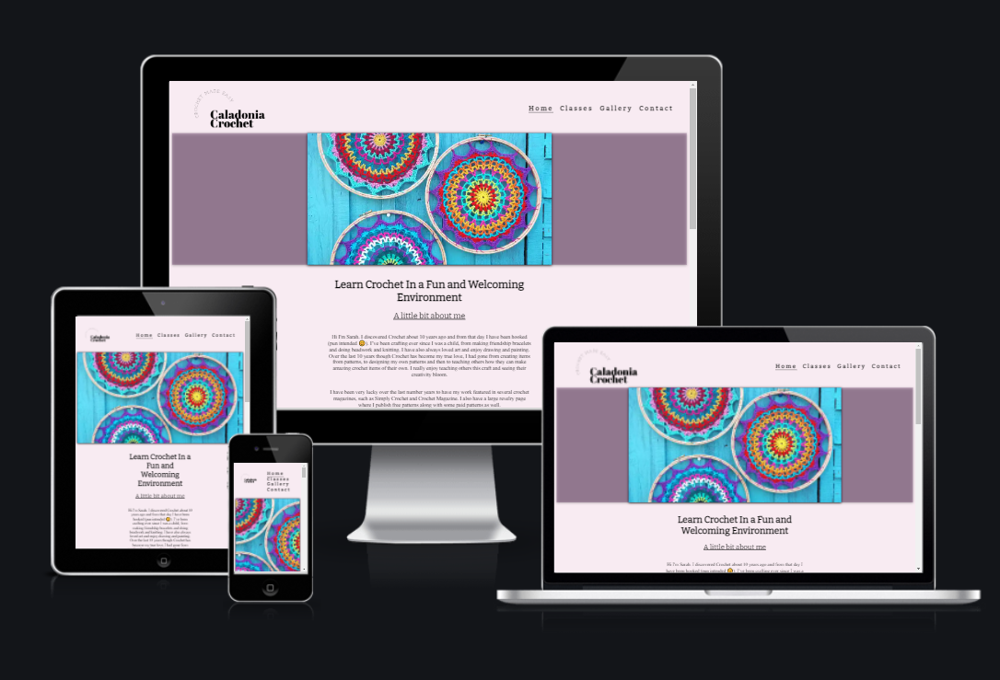

# Target Audience
The target audience for this website are people who are interested in art and crafting and specifically those looking to learn crochet. There has been a huge resurgence in crochet through platforms such as instagram and pinterest so there is a market and need for a site where people in Ireland can sign up to learn crochet.
There is another audience of those who can already crochet who will find this website useful as a way to get an overview and easy access to the teachers crochet patters. 

# User Stories
### First Time Visitor Goals
As a first-time visitor I want to easily understand the purpose of the site and learn more about the crochet teacher. I want to be able to easily navigate throughout the site to find content. I want to view the website and content clearly on various devices. I want to be able to easily follow Caladonia Crochet on social media. I want to get an understanding of what is involved in the classes.
### Returning Visitor Goals
As a returning visitor I want to be able to contact the site owner to sign up or ask questions. I want to be able to find links to the crochet designs displayed on the site that I had seen on my initial visit.
### Frequent Visitor Goals
I want to be able to check if there are new classes being offered. I want to be able to check if there are new patterns advertised since the last time I visited.

# Design

### Colour scheme
I have used a consistent colour scheme for this website to give a sense of cohesion and compliment the colourful images of crochet. The text is black and there is also white text used as well when black would not give a strong enough contrast. Links and navigation turn bright pink (#d813d2) when hovered over. The main body of the page is a very light pink rgb(248, 235, 242, 0.30) and it is accented with a dusky purple rgb(80, 16, 80, 0.30). The colours are muted except for a pop of bright pink on links when hovered over. This lets the colours of the imagery be the main focus of the page.

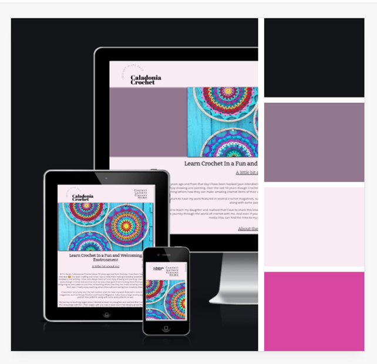

### Logo 

I created the logo for the website using Adobe Express. I wanted something that could act as a brand for the website. This can be used on the site owners social media and any patterns they create so that their work can be easily recognised and help bring users to the website.

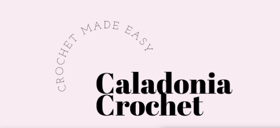

### Typography

I choose the font to compliment the Logo. I choose Bitter and Open-sans. I used Bitter for my headings as it is similar to the Logo font. And open-sans is a complimentary font to Bitter. I wanted a very minimal font so as not to distract from the imagery. 

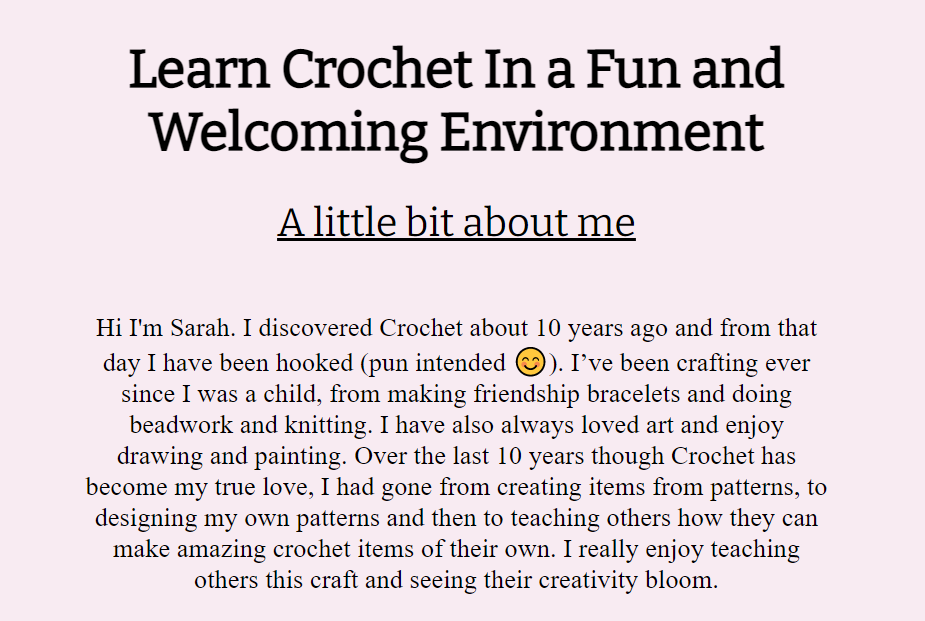

### Imagery
I have used several images from the crochet teacher, her style is very colourful and vibrant. The muted colours of the website help to emphasise the vibrancy of the imagery. The images will create a sense of confidence in the teachers’ skills and hopefully encourage the user to want to sign up to her classes. The images in the gallery section all link to external sites such as ravelry where the user can purchase these patterns. This can generate another revenue stream for the site owner. 
I have added drop shadows to the images to give a sense of depth to the page and this emphasises the imagery further.

# Wire frames
### Home
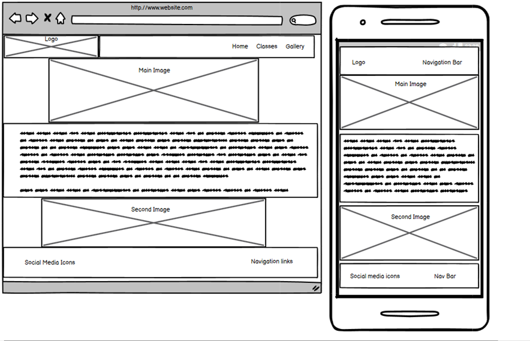
### Classes
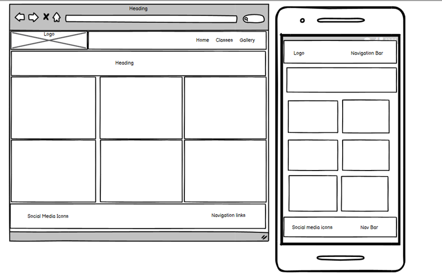
### Gallery
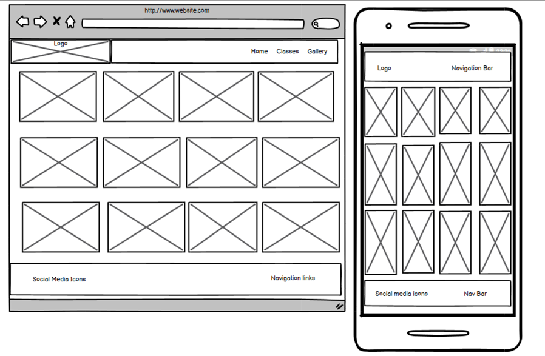
### Contact
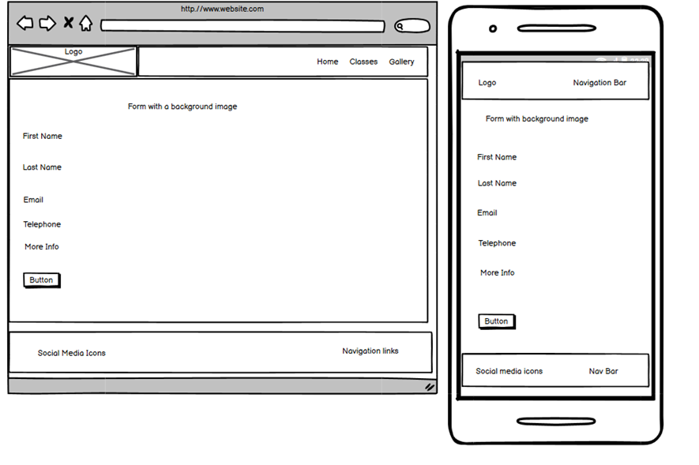

# Features 

### Existing Features

- __Navigation Bar And Logo__

  - Featured on all four pages, the fully responsive navigation bar includes links to the Home page, Gallery page, Classes page and Contact page and is identical in each page to allow for easy navigation.
  - This section will allow the user to easily navigate from page to page across all devices without having to revert back to the previous page via the ‘back’ button. 
  - Logo is featured on all four pages, it is the brand of the crochet teacher and is used so that the user can recognise this teachers work across social media platforms and pattern websites. The logo creates brand recognition.
  - The Logo is also a link which if clicked will bring the user back to the home page, this is a standard in websites so is included as this will be what the user is expecting.

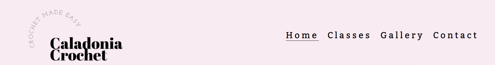

- __The Footer__ 

  - The footer section includes links to the relevant social media sites for the site owner. 
  - The footer is valuable to the user as it encourages them to keep connected via social media.
  

- __Main page images__

  -  The main page contains a pictures of some crochet, it is designed to catch the users eye and give them an example of what they could create by taking a class. 
  - It should grab the users attention and give them a positive emotional response which will encourage them to stay on the site and explore it further. 

- __About Section__

  - The About me section will allow the user to get familiar with the crochet teacher and to learn about their experience as an artist and teacher. 
  - This section should create a sense of trust between the user and the teacher which will encourage them to sign up for the classes.
  - The About the Class section will describe how the classes are run, what to expect and to answer any common questions users may have.
  - This section is designed to create a positive emotional response. It should put the user at ease and give them the confidence that they would enjoy their interaction in the class if they sign up.

- __Classes Page__

  - This section will allow the user to see exactly when the classes happen, where they will be located and how long the class is 
  - This section will be updated as these times change and more classes are added to keep the user up to date.  
  -This image on this page ties in with the aesthetics of the website, giving the user another example of the work of the crochet teacher.

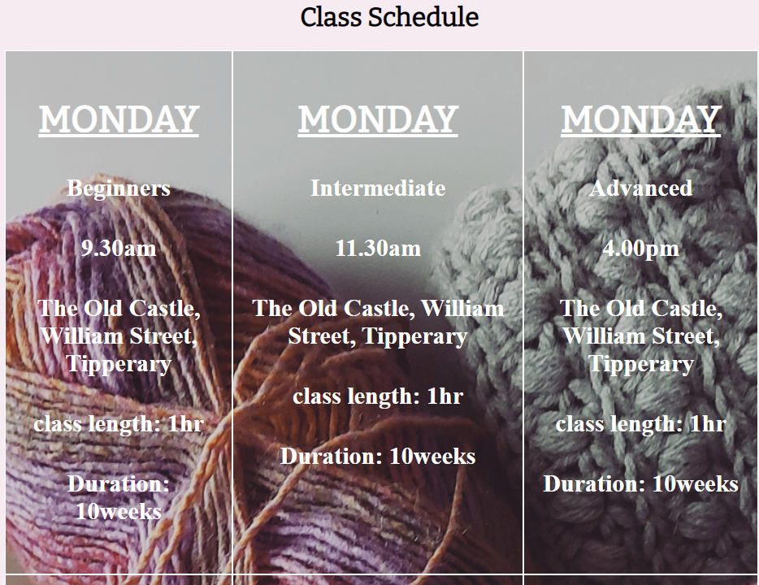 

- __Gallery__

  - The gallery provides users with images of the crochet teachers work to advertise her skills
  - This section is valuable to the user as they will be able to see the types of work created in the class and 
  - the user will be able to then decide if this is a style they are interested in.
  - This section also has links to the patterns when the images are clicked on.
  - This is valuable for the user as even if they dont sign up to the class they can still find the links to purchase the patterns from the teacher. 
  - This is valuable for the teacher as even if they do not sign up for the class this can still generate revenue.

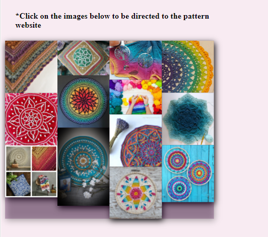

- __The Contact Page__

  - This page will allow the user to enter their details so that they can be contacted by the site owner to schedule their class. The user will be able specify what class level they are interested in, beginner, intermediate or advanced. The user will be asked to submit their full name, email address and contact number. They will also be able to submit any extra questions or requirements they may have so the site owner can assist them further. 

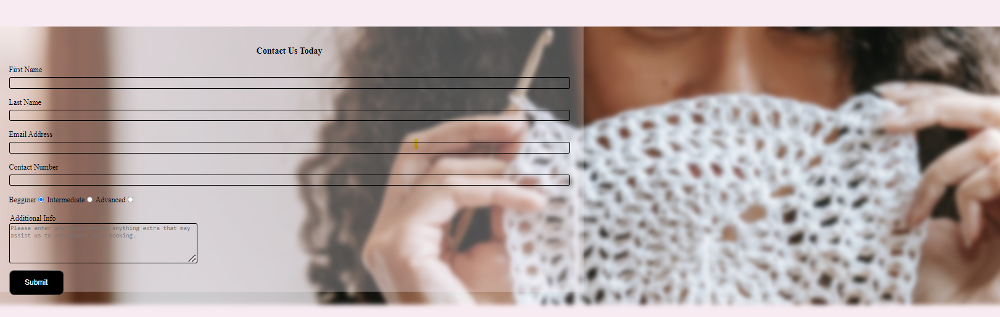

### Features Left to Implement

- In the future I hope to add a sign up feature where the user can subscribe to a newsletter to be alerted when new classes or patterns are released.
- Another feature that I would like to implement would be the some videos on the site to tutorials the teacher has created on Youtube as this is commonly seen on many crochet sites and would be another draw for the user. 

# Testing 

## Manual Testing

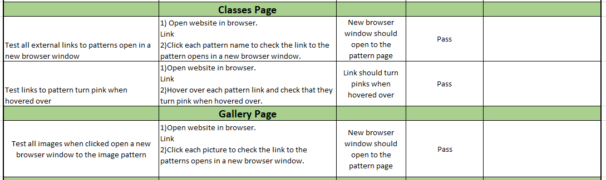
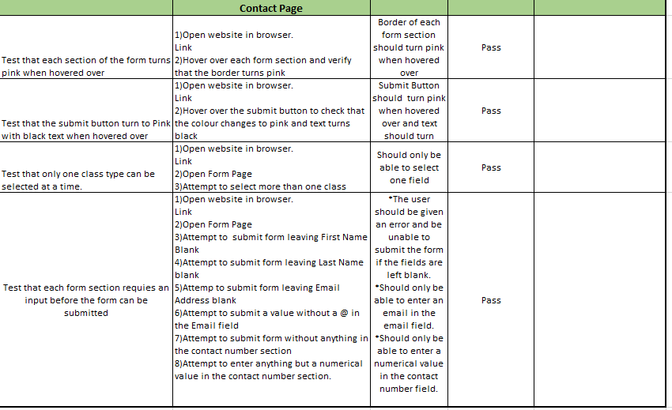

## Issues and Resolutions to issues found during testing
- Clicking the logo doesn't redirect to home page. I resolved this by adding a href link to the home page
- Images were too large causing performance issues. I resized images and converted some to gif to have the page run more smoothly.
- Spelling mistakes were found when proof reading, these were corrected.
- Form was accepting multiple selections for class level. Changed to radio so only one can be checked at a time.

## Lighthouse Testing

#### Home Page
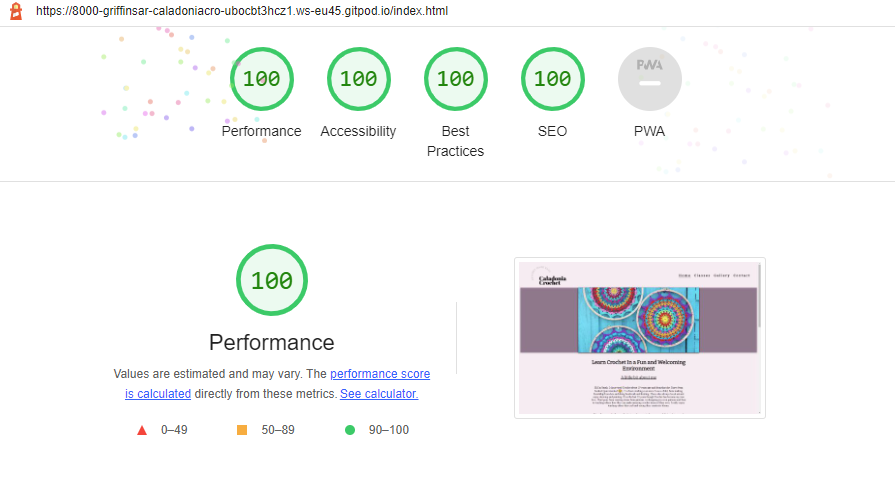
#### Classes Page
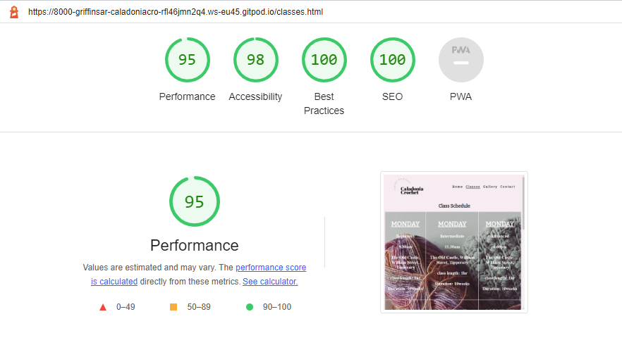
#### Gallery Page
(Not completed - need to resize image)
#### Contact Page
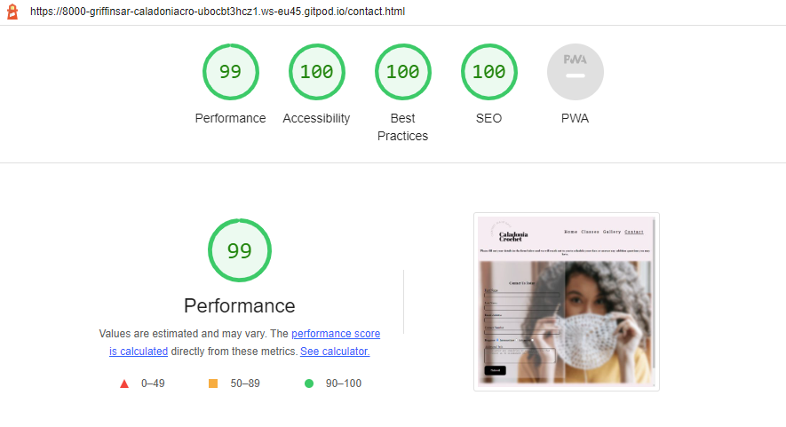

### Validator Testing 

- HTML
  - One error when passed through [W3C validator](https://validator.w3.org/nu/?doc=https%3A%2F%2Fcode-institute-org.github.io%2Flove-running-2.0%2Findex.html)

### Home Page
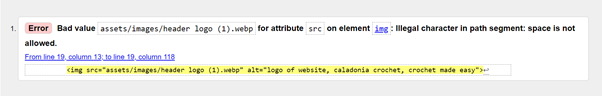

- Solution: renamed image to header-logo to remove spaces and replicated on each page for the site.

- CSS
  - One Error Found when passed through [(Jigsaw) validator](https://jigsaw.w3.org/css-validator/validator?uri=https%3A%2F%2Fvalidator.w3.org%2Fnu%2F%3Fdoc%3Dhttps%253A%252F%252Fcode-institute-org.github.io%252Flove-running-2.0%252Findex.html&profile=css3svg&usermedium=all&warning=1&vextwarning=&lang=en#css)

  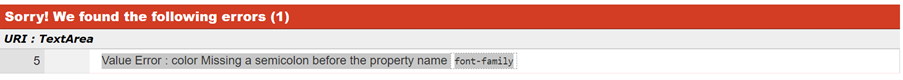
  - Solution: Added semicolon to the color in the body section.

## Deployment

(This section not completed yet)

This section should describe the process you went through to deploy the project to a hosting platform (e.g. GitHub) 

- The site was deployed to GitHub pages. The steps to deploy are as follows: 
  - In the GitHub repository, navigate to the Settings tab 
  - From the source section drop-down menu, select the Master Branch
  - Once the master branch has been selected, the page will be automatically refreshed with a detailed ribbon display to indicate the successful deployment. 

The live link can be found here - (Add live site link!) 

# Credits 

### Content 

- All text used throughout the site was written by me.
- All the business information such as the classes was created by me.

### Media

- Several the photos used on the site are my own. The listed images below are mine.
  -	Crochet candle image from classes page
  -	Crochet red from the gallery page
  -	Crochet blue from the gallery page
  - My crochet from the gallery page
  - Rainbow crochet from the gallery page

- Images below were from the website the guy with the hook (https://theguywiththehook.com/)
  -	Crochet 4 images from the gallery page
  -	Pillow from the gallery page
  -	Van gogh images from the gallery page

- Images below were taken from Lilla Bjorn crochet website (https://www.lillabjorncrochet.com/)
  - Mandala image from the main page

- Images below were sourced from the look what I made website (https://lookatwhatimade.net/)
  - Fancy Nancy image from the gallery page

- Image below sourced from Annie design crochet (https://www.anniedesigncrochet.com/crochet-mandala-pattern/)
  - Main Image on home page

- Image below sourced from Mijo Crochet (https://mijocrochet.se/2017/03/15/lost-in-time-shawl-sjal/)
  - Scarf image from the gallery page

-Image below sourced from Ravelry (https://www.ravelry.com/projects/jellina/rozeta-scheepjes-cal-2019)
  -	Scheepjes Rozetta image from gallery page

-Image below sourced from (https://classbento.com.au/7-trending-crafts-to-sink-your-hands-into-in-2022)
  -	Woman crochet image from Contact page

-The Logo for the page was created in Adobe express by me.

### Code

I used the below sites to help me design and style my site.

- Reference for Align
  -https://www.w3schools.com/css/css_align.asp

- References for Flex Box
  -https://www.w3schools.com/cssref/pr_class_display.asp
  -https://www.youtube.com/watch?v=RSIclWvNTdQ

- Reference for Z-index
  -https://www.w3schools.com/cssref/pr_pos_z-index.asp

- Reference for Textarea
  -https://stackoverflow.com/questions/43793639/change-placeholder-text-color-of-textarea

- Reference for Blurred Background
  -https://www.w3schools.com/howto/howto_css_blurred_background.asp

- Reference for Grid
  -https://www.w3schools.com/css/tryit.asp?filename=trycss_grid
  -https://stackoverflow.com/questions/49880534/-how-to-make-3-column-css-grid-change-into-1-column-on-mobiles-with-media-query
  -https://www.w3schools.com/css/css_grid.asp
  -https://css-tricks.com/snippets/css/complete-guide-grid/

### Technologies

- The project was primarily written in HTML and CSS. 
- The project was written and tested in the Gitpod IDE.
- The project was debugged using Google Chrome Dev Tools.
- The project's template was generated from Code Institute's Gitpod Template.
- The project uses FontAwesome.
- The project uses Google Fonts for typography.
- The images were converted to webp using cloud convert
- The project's accessibility was tested via Google Chrome's Lighthouse.
- The project's HTML was validated using W3C HTML Markup Validator.
- The project's CSS was validated using W3C Jigsaw CSS Validator.
- The project's wireframes were designed in Balsamiq.
- The project's logo was designed using Adobe Express.
- Some of the  images were resized using microsoft paint.

# Acknowledgements
The concept for this project has come from my love of crochet, art, and beautiful design. 
Thank you to my mentor, Ronan McClelland, who provided a huge amount of support and guidance for this project. 

Thank you to my brother Karl, who looked over my project and gave me constructive feedback from his perspective as a software developer. 

Thank you to my husband and children who have patiently put up with me over the last few weeks while I have given alot of my attention to getting this project completed.

## Disclaimer
This website is for educational purposes only.

